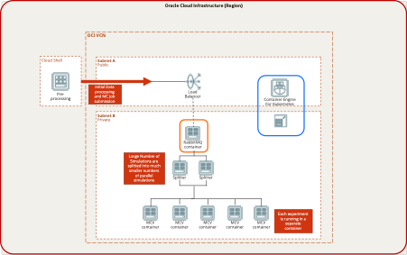

# race-simulation

This is an example on how to run MonteCarlo analysis for F1 race strategy. You can find out a lot more about the background [here](https://blogs.oracle.com/cloud-infrastructure/post/modernize-your-motor-sport-race-strategy-on-oracle-cloud-infrastructure) The actual simulation of the race is using the work found [here](https://github.com/TUMFTM/race-simulation)
Running billions of race simulations can take a significant amount of time. This is why we wil use cloud native applications to parallelize this work in order to get the information faster. 
Actual teams are using a similar approach live during the race to predict pit stops and tyres compounds. This example will focus on making pre-race decisions and looking at how the strategies are giving different expected results. 

## Overal architecture:

