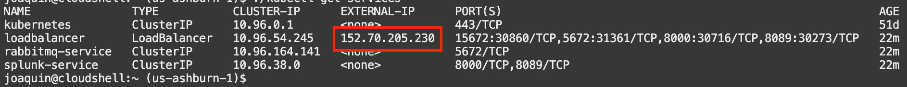

# Race Simulation

This is an example on how to run MonteCarlo analysis for F1 race strategy. You can find out a lot more about the background [here](https://blogs.oracle.com/cloud-infrastructure/post/modernize-your-motor-sport-race-strategy-on-oracle-cloud-infrastructure) The actual simulation of the race is using the work found [here](https://github.com/TUMFTM/race-simulation)
Running billions of race simulations can take a significant amount of time. This is why we wil use cloud native applications to parallelize this work in order to get the information faster. 
Actual teams are using a similar approach live during the race to predict pit stops and tyres compounds. This example will focus on making pre-race decisions and looking at how the strategies are giving different expected results. 

## Overal architecture:

## Demo

### Setting up the OKE cluster
- Connect to your tenancy through the [cloud console](https://cloud.oracle.com/)
- Go to Menu/Developer Services/Kubernetes Clusters (OKE)
- Click on **Create Cluster** and select **Quick Create**
- Choose a name, select **Public Endpoint** and **Private Workers** as well as a shape. Depending on your limits, you can choose add more or less nodes to your pool with varying size. We can start with 3 VM of Standard.E3.Flex with 8 cores and 8GB or RAM. 

While Oracle Cloud is doing magic in the background, let's configure the cloud shell. 

### Connect to the cluster through the Cloud Shell

The Cloud Shell a small free VM inside of the console that will allow you to connect easily to the OKE cluster. You can also spin up an actual VM to do this.
Click on this icon on the top right corner to launch a cloud shell:          

To connect to the RabbitMQ service, we will need to run `pip3 install pika`. 

You can grab the files in the CloudShell folder. It includes: 
- Deployment files for OKE
- Python code for the client

In the worker.yaml and splitter.yaml, adjust the replica number to decide the number of processes for each. If you are using 3*8cores AMD VMs, leave 2 cores for RabbitMQ and a 4 cores for the splitters. So you can have 15 workers in your cluster. (Each VM needs to keep one core for managing the pods).

Once the cluster has finished creating the cluster, click on the cluster name and select **Access your cluster**
Select **Cloud shell access** ( or **Local access** if you are planning to use a separate VM).

### Launch services

Run the next commands: 
- `kubectl create -f rabbitmq-controller.yaml`
- `kubectl create -f rabbitmq-service.yaml`
- `kubectl create -f loadbalancer-service.yaml`
This will launch the RabbitMQ service and load balancer. 

RabbitMQ GUI: 

You can check that the RabbitMQ host is running, accessing through the WEB GUI and mcv-controller and mcv-parent-controller consumers are connected to the tasks_in and tasks_in_splittable queues respectively.

Access your RabbitMQ Management GUI
Run the next command to list the load balancer service and get the external IP:

`kubectl get services`

You can reach the RabbitMQ Management GUI: loadbalancer_externalip:15672

Credentials: guest/guest

### Launch pods

Run the next commands: 
- `kubectl create -f splitter.yaml`
- `kubectl create -f worker.yaml`

### Submit Initial Job

Finally edit the client.py file. The scenario's are described at line 43 to 67. A3, A4 and A6 are the tire compounds available for this track. You can choose the initial compoud as well at the stops that you make. At which lap and what compound you need. Keep in mind that you need at least 2 different compounds per race. 

For each scenario, we'll run no_sim_runs experiemnts, the default value is 500. Each worker will run 10 experiment at the time. So for each scenario, we'll post 50 messages and gather all the results and average them out. 

